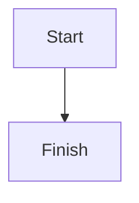

<div align="center">
  
  <h1>ChatGPT Voyager</h1>
  <p>An all-in-one enhancement suite for the ChatGPT web interface.</p>
</div>

## About
**ChatGPT Voyager** is a Chrome extension that adds organization, navigation, export, and quality-of-life tools directly to `chatgpt.com`.

The project is inspired by [gemini-voyager](https://github.com/Nagi-ovo/gemini-voyager), but it is built for ChatGPT workflows. It is designed for people who manage many chats, reuse prompts often, work with long reasoning outputs, or need faster navigation inside long conversations.

All extension data is stored locally in your browser with `chrome.storage.local`. The extension does not require an external server.

## What It Adds

### Chat Organization
* **Folders**: Add a two-level folder system to the ChatGPT sidebar.
* **Batch Delete**: Select multiple chats and delete them in one pass.
* **Hide Recents**: Hide the default date-grouped recent sections in the sidebar.

### Workflow Tools
* **Prompt Vault**: Save, search, edit, and reuse prompts.
* **Timeline Navigation**: Jump through long conversations from a compact timeline on the right side.
* **Chat Export**: Export the current conversation as JSON, Markdown, or PDF.
* **Quote Reply**: Turn selected assistant text into a quoted reply in the input box.
* **Default Model**: Auto-select your preferred model on a new chat page.
* **Tab Title Sync**: Sync the browser tab title to the current conversation title.

### Output Enhancements
* **Deep Research Extractor**: Extract text and cited URLs from reasoning or thinking blocks.
* **Formula Copy**: Copy raw LaTeX or MathML from rendered formulas.
* **Mermaid Rendering**: Render Mermaid code blocks inline as diagrams.

### UI Tweaks
* **Input Collapse**: Shrink the input area when it is not focused.
* **Prevent Auto-Scroll**: Keep your reading position when sending a prompt.

## Requirements
* Google Chrome or another Chromium-based browser that supports Manifest V3 extensions.
* Access to [chatgpt.com](https://chatgpt.com).

## Installation

### Install From Release
1. Open the [Releases](https://github.com/hayashishungenn/chatgpt-voyager/releases) page.
2. Download the latest `chatgpt-voyager-v1.x.x.zip`.
3. Extract the ZIP file to a folder on your computer.
4. Open Chrome and go to `chrome://extensions/`.
5. Enable **Developer mode** in the top-right corner.
6. Click **Load unpacked**.
7. Select the extracted folder that contains `manifest.json` and the built `dist` assets.
8. Open [chatgpt.com](https://chatgpt.com).

### Build From Source
1. Clone this repository.
2. Install dependencies:

```bash
npm install
```

3. Build the extension:

```bash
npm run build
```

4. Open `chrome://extensions/`.
5. Enable **Developer mode**.
6. Click **Load unpacked**.
7. Select the project folder after the build completes.

## First-Time Setup
1. Open the ChatGPT Voyager popup from the Chrome extensions toolbar.
2. Enable or disable the features you want.
3. If you want a preferred model on every new chat, enter a model name in **Default Model**.
4. If you want one export format to be used most often, choose it in **Default Export Format**.
5. Refresh `chatgpt.com` once if the page was already open before the extension was loaded.

## How To Use

### Open the Settings Panel
Click the ChatGPT Voyager icon in the Chrome toolbar. The popup lets you:
* toggle features on or off
* set a default model name
* choose the default export format

Settings are saved automatically in local browser storage.

### Folders
The extension injects a **Folders** section into the ChatGPT sidebar.

How to use it:
* Click `+` in the folder header to create a new root folder.
* Click a folder to filter the sidebar to chats assigned to that folder.
* Drag a conversation from the ChatGPT sidebar into a folder to assign it.
* Right-click a folder to rename it, add a subfolder, change its color, move it back to the root, or delete it.
* Click a parent folder to expand or collapse its subfolders.

Behavior notes:
* The folder system supports two levels: root folders and one level of subfolders.
* Deleting a folder does not delete the ChatGPT conversations inside it. It only removes the folder structure stored by the extension.

### Batch Delete
Batch delete is part of the folder sidebar tools.

How to use it:
* In the folder header, click **Batch**.
* Check the conversations you want to remove.
* Click **Delete Selected** in the batch toolbar.
* Confirm the deletion.

Behavior notes:
* This uses ChatGPT's own delete flow in the UI.
* Deleted chats cannot be recovered through the extension.

### Hide Recents
Enable **Hide Recents** in the popup to hide the default date-grouped sections such as "Today" and "Yesterday" in the ChatGPT sidebar.

This is useful if you want the custom folder section to take over the sidebar without the default grouped headings.

### Prompt Vault
Prompt Vault adds a button near the ChatGPT composer.

How to use it:
* Click the Prompt Vault button beside the send area.
* Click **New Prompt** to create a reusable prompt.
* Add a title, content, and optional comma-separated tags.
* Use the search box to filter saved prompts.
* Click **Use** to insert a prompt into the current input box.
* Click **Edit** or **Delete** to manage saved prompts.

Behavior notes:
* Prompts are stored locally in your browser.
* Saved prompts are sorted by most recently updated first.

### Timeline Navigation
Timeline Navigation appears on the right side of a conversation page.

How to use it:
* Open any existing conversation.
* Use the timeline nodes on the right side to jump to specific messages.
* Click a node to scroll to that message.
* Double-click a node to star or unstar that message.

Behavior notes:
* The timeline is only shown on conversation pages, not on a blank new-chat page.
* Starred message state is stored locally.

### Chat Export
Chat Export adds an **Export** button near the top-right area of the page on a conversation page.

How to use it:
* Open the conversation you want to export.
* Click **Export**.
* Choose one of the available formats:
  * `JSON` for structured data
  * `Markdown` for clean text export
  * `PDF` to open the browser print dialog and save as PDF

Behavior notes:
* JSON includes conversation metadata and message content.
* Markdown includes user and assistant sections in order.
* PDF export opens a printable HTML view in a new tab or window.

### Quote Reply
Quote Reply works directly inside assistant responses.

How to use it:
* Select text inside an assistant message.
* Wait for the floating **Quote Reply** button to appear.
* Click it.
* The selected text will be inserted into the composer as block quotes.

Behavior notes:
* The feature only appears when the selection is inside an assistant message.
* Very short selections are ignored.

### Default Model
Default Model helps you auto-select a preferred model on new chats.

How to use it:
* Open the extension popup.
* Enter a model name in **Default Model**. Example: `o1`, `GPT-4o`.
* Open a new chat page.

Behavior notes:
* The extension matches the model by text in the ChatGPT model menu.
* Use a model name that appears clearly in the ChatGPT UI.
* This runs on a new chat page, not inside an existing conversation URL.

### Tab Title Sync
Enable **Tab Title Sync** in the popup.

What it does:
* When the conversation title changes, the browser tab title is updated to match it.
* This makes it easier to identify chats in multiple open tabs.

### Prevent Auto-Scroll
Enable **Prevent Auto Scroll** in the popup.

What it does:
* When you press `Enter` to send a message, the extension tries to preserve your current reading position instead of forcing the view to the bottom.

This is most useful when you are reviewing older messages while preparing a follow-up prompt.

### Input Collapse
Enable **Input Collapse** in the popup.

What it does:
* The input area shrinks when it loses focus.
* The input area expands again when you focus it.

This helps recover vertical space for reading long conversations.

### Deep Research Extractor
Deep Research Extractor works on reasoning or thinking blocks when ChatGPT exposes them in the page.

How to use it:
* Open a response that contains a reasoning or thinking block.
* Click **Extract** inside that block.
* In the modal, copy the full extracted text or copy the referenced URLs only.

Behavior notes:
* Availability depends on the model and the way ChatGPT renders reasoning content.
* If ChatGPT changes its DOM structure, selector updates may be required.

### Formula Copy
Formula Copy adds copy buttons next to rendered formulas.

How to use it:
* Open a response that contains math.
* Click **Copy LaTeX** or **Copy MathML** next to the rendered formula.

Behavior notes:
* KaTeX-based formulas expose LaTeX and sometimes MathML.
* MathJax-based formulas are also detected where possible.

### Mermaid Rendering
Mermaid Rendering detects Mermaid code blocks inside ChatGPT messages.

How to use it:
* Ask ChatGPT to output a Mermaid diagram in a fenced code block such as:

````text

````

* When the response appears, the extension renders the diagram below the original code block.

Behavior notes:
* If rendering fails, the original Mermaid code block remains visible.

## Data Storage and Privacy
ChatGPT Voyager stores its own data in `chrome.storage.local`.

This includes:
* folders
* folder assignments
* saved prompts
* starred timeline messages
* extension settings

The extension does not require a separate backend service for these features.

## Known Limitations
* ChatGPT changes its DOM frequently. If selectors change, some features may need updates.
* Default Model depends on matching visible model names in ChatGPT's menu.
* Deep Research extraction depends on the presence of reasoning blocks in the page.
* Batch Delete relies on ChatGPT's current menu structure and confirm dialog flow.

## Development

### Useful Commands
```bash
npm run build
npm run typecheck
```

### Project Notes
* The extension is built with Vite and TypeScript.
* The popup UI is implemented with React.
* Feature state is stored locally through the Chrome extension storage API.

## Acknowledgements
Heavy inspiration and functional design ideas are drawn from [gemini-voyager](https://github.com/Nagi-ovo/gemini-voyager) by Nagi-ovo.

## License
MIT License.
